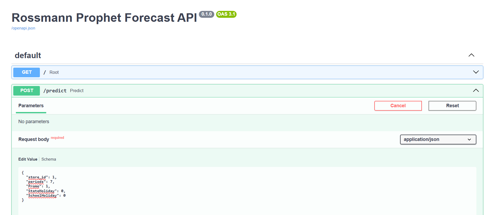
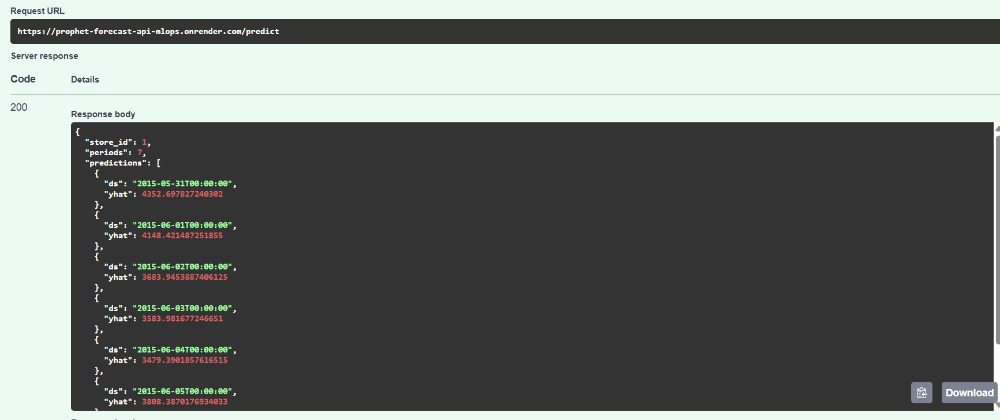

# Rossmann Prophet Forecast API

This project is a **refactored and improved version** of my first Machine Learning solution for Rossmann Sales Forecasting.  
In this new version, I applied **advanced techniques**, **clean code modularization**, **Dockerization**, and **MLOps practices**, including CI/CD with GitHub Actions and deployment on Render.

The final result is a fully functional **forecasting API** capable of predicting daily sales for Rossmann stores using **Prophet** models.

---

## Table of Contents

1. [Project Overview](#project-overview)  
2. [Dataset](#dataset)  
3. [Project Structure](#project-structure)  
4. [Modeling](#modeling)  
5. [API](#api)  
6. [Docker & Deployment](#docker--deployment)  
7. [GitHub Actions & CI/CD](#github-actions--cicd)  
8. [Usage](#usage)  
9. [Screenshots](#screenshots)  
10. [Future Improvements](#future-improvements)  

---

## Project Overview

The goal of this project is to build a **time series forecasting API** capable of predicting future sales for individual Rossmann stores.

This version brings:

- Cleaner and fully modular code  
- Reusable modeling functions  
- Separation between API, configuration, and modeling logic  
- Environment variable control for Render  
- Docker containerization  
- CI/CD automation with GitHub Actions  
- Deployment on Render  
- Organized model storage  

This allows anyone (or any system) to request forecasts programmatically through a REST API.

---

## Dataset

The original Rossmann dataset contains:

- **`train.csv`** – historical daily sales  
- **`test.csv`** – test set  
- **`store.csv`** – store metadata  

A custom train/validation split was used:  

- **Training until:** `2015-06-01`  
- **Validation after:** that date
- 
Validation was performed using **TimeSeriesSplit**, MAE and RMSE metrics — executed offline, during the modeling stage.

---

## Project Structure
```plaintext
prophet-forecast-api-mlops/
├── Dockerfile
├── docker-compose.yml
├── requirements.txt
├── README.md
│
├── data/
│   └── raw/
│       ├── store.csv
│       ├── test.csv
│       └── train.csv
│
├── models/
│   ├── prophet_store_1.joblib
│   ├── prophet_store_2.joblib.....
│
├── src/
│   ├── config.py
│   │
│   ├── api/
│   │   ├── main.py         
│   │   └── schemas.py      
│   │
│   ├── data/
│   │   ├── load_data.py    
│   │   └── preprocess.py   
│   │
│   ├── modeling/
│   │   ├── train.py        
│   │   ├── model_utils.py   
│   │   └── validation.py    
│   │
│   ├── monitoring/
│   │   ├── drift_report.py  
│   │   └── metrics.py      
│   │
│   ├── retraining/
│   │   └── retrain.py      
│   │
│   └── tests/
│       ├── test_api.py
│       ├── test_data.py
│       ├── test_model.py
│       └── test_utils.py

```


## Modeling

The forecasting solution uses Prophet with additional regressors:

- Promo
- StateHoliday
- SchoolHoliday

A separate model is trained for each store.
Models are saved into the models/ directory as .joblib files, and the API loads the correct model dynamically based on the input store ID.

## API

The API was built using **FastAPI** and exposes 2 endpoints:

### 1. GET /

Health check endpoint. Returns:

```json
{
  "status": "ok"
}
```

### 2. POST /predict

Returns future sales forecasts.

📌 IMPORTANT:
To test the API in the browser, use the interactive docs:

➡️ https://prophet-forecast-api-mlops.onrender.com/docs

```Example Request
{
  "store_id": 1,
  "periods": 7,
  "Promo": 1,
  "StateHoliday": 0,
  "SchoolHoliday": 0
}
```
```Example Response
{
  "store_id": 1,
  "periods": 7,
  "predictions": [
    {"ds": "2015-05-31T00:00:00", "yhat": 4352.69},
    {"ds": "2015-06-01T00:00:00", "yhat": 4210.15},
    ...
  ]
}
````
## Docker & Deployment

This project is fully containerized using Docker.

Build locally:

docker build -t rossmann-api

Run:

docker run -p 8000:8000 rossmann-api

Deployment on Render

The project is deployed automatically on Render via a Deploy Hook.

Every push to the master branch triggers:

- Docker image build

- Push to Docker Hub

- Automatic deployment to Render
  
The API is deployed at:

➡️ https://prophet-forecast-api-mlops.onrender.com

## GitHub Actions & CI/CD

The project includes a GitHub Actions workflow that performs:

- Code checkout and validation

- Automated Tests
  
- Building the Docker image
  
- Pushing the image to Docker Hub
  
- Automatic deployment to Render using a Deploy Hook

# Screenshots

## 1. Production API Execution — POST /predict


This screenshot shows a real test of the endpoint in the production environment (Render), including:
- The JSON payload sent via Swagger
- The “Execute” action
---

## 2. API Response with Forecast Results
 


This screenshot shows:
- The full prediction output returned by the Prophet model
- HTTP status code 200
- The API running successfully in production with no errors

## Future Improvements

### **Phase 1 – Application Layer**
- Add web interface (Streamlit/Gradio)
- Add API authentication

### **Phase 2 – ML Engineering**
- Automated retraining pipeline
- Manage models with Git LFS/DVC
- Add new regressors

### **Phase 3 – MLOps & Observability**
- Monitoring dashboard (Prometheus + Grafana)
- Batch forecasting for all stores


